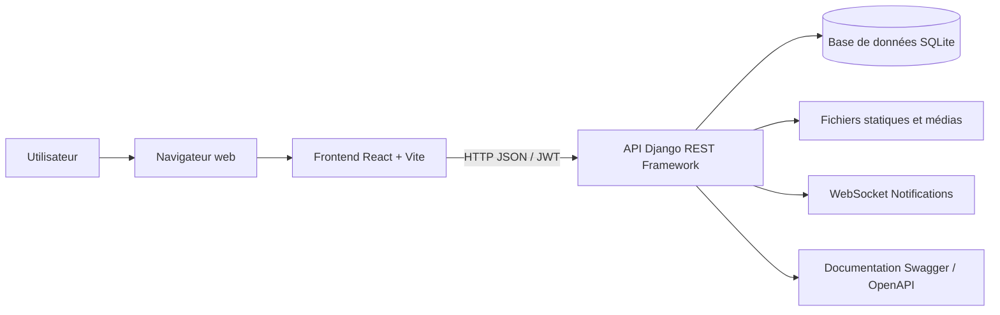
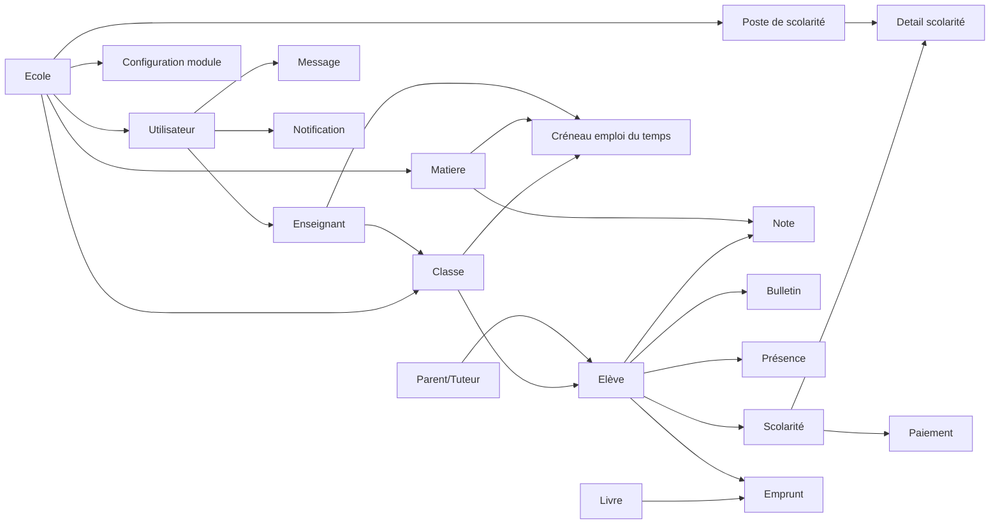
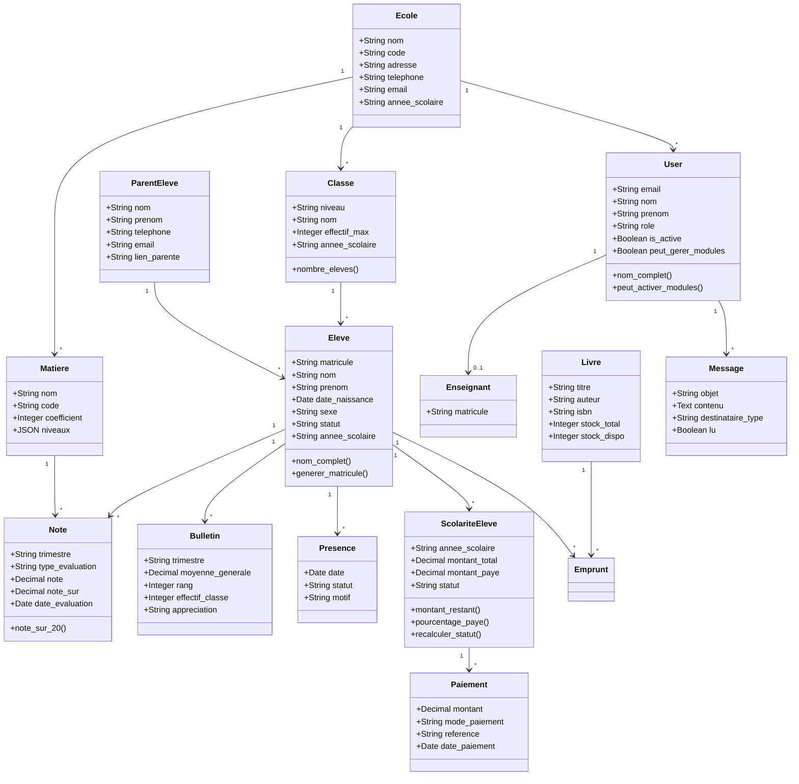
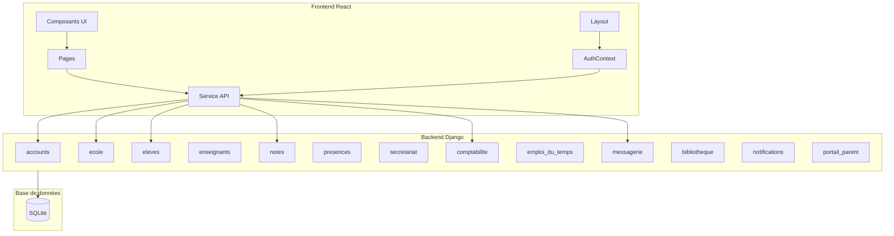
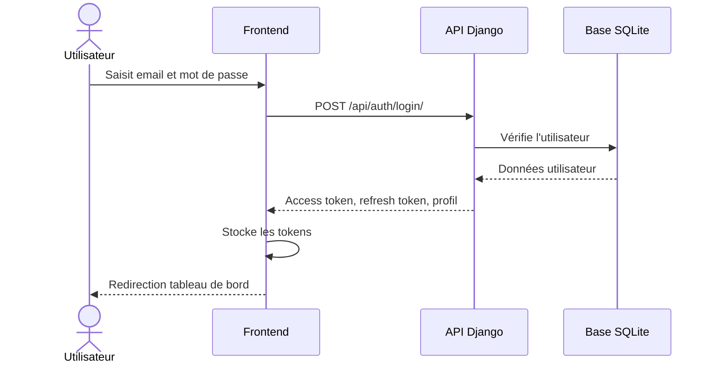
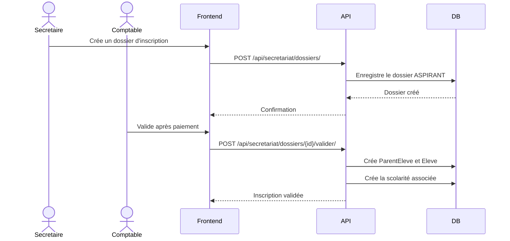
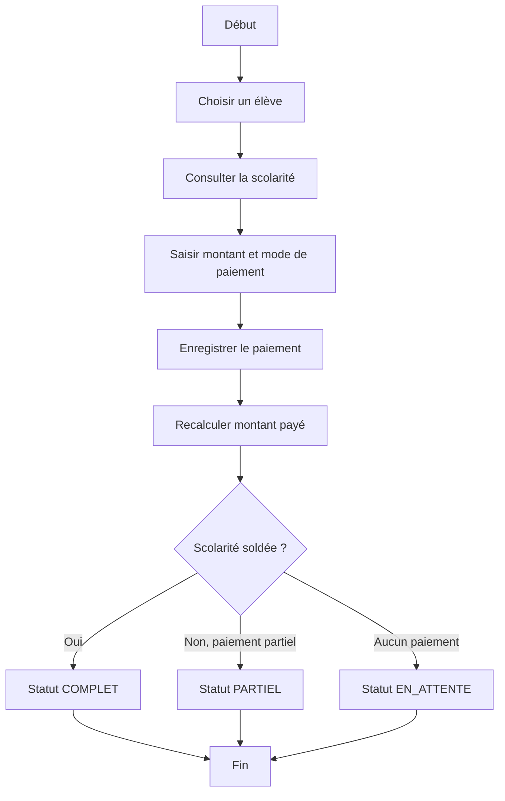

# Rapport de stage / Projet de soutenance

## Conception et réalisation d'une application web de gestion d'école primaire : EduPrimaire

**Filière :** Licence en informatique  
**Projet :** EduPrimaire  
**Type :** Application web de gestion scolaire  
**Année académique :** 2025-2026  
**Étudiant :** À compléter  
**Encadreur :** À compléter  
**Établissement :** À compléter  

---

## Résumé

EduPrimaire est une application web conçue pour faciliter la gestion administrative, pédagogique et financière d'une école primaire. Le système centralise les informations liées aux élèves, parents, enseignants, classes, notes, présences, paiements, emplois du temps, messages, bibliothèque et portail parent. L'objectif est de remplacer ou compléter les méthodes manuelles de gestion scolaire par une plateforme numérique simple, sécurisée et modulaire.

Le projet repose sur une architecture client-serveur. Le frontend est développé avec React, Vite et Tailwind CSS. Le backend est développé avec Django, Django REST Framework et une base de données SQLite. L'API REST permet au frontend de communiquer avec le serveur, tandis que l'authentification JWT sécurise l'accès aux fonctionnalités selon le rôle de l'utilisateur.

Ce rapport présente le contexte du projet, les objectifs, l'analyse fonctionnelle, l'architecture technique, les technologies utilisées, les diagrammes UML, la structure de la base de données, les principales fonctionnalités, les choix de conception, les tests, les limites et les perspectives d'évolution.

**Mots-clés :** gestion scolaire, Django, React, API REST, JWT, UML, école primaire, application web.

---

## Table des matières

1. Introduction générale
2. Présentation du projet
3. Étude de l'existant et problématique
4. Objectifs du projet
5. Méthodologie de réalisation
6. Analyse fonctionnelle
7. Technologies utilisées
8. Architecture du système
9. Modélisation UML
10. Description des modules
11. Sécurité et gestion des rôles
12. Déploiement
13. Tests et validation
14. Limites et perspectives
15. Conclusion
16. Annexes

---

## 1. Introduction générale

La gestion d'une école primaire implique de nombreuses tâches quotidiennes : inscription des élèves, suivi des classes, gestion des enseignants, saisie des notes, édition des bulletins, suivi des présences, encaissement des frais de scolarité, communication avec les parents et conservation des informations administratives. Lorsque ces tâches sont réalisées manuellement, elles deviennent longues, répétitives et exposées aux erreurs.

Dans ce contexte, la numérisation des processus scolaires constitue une solution efficace pour améliorer l'organisation interne, accélérer le traitement des données et faciliter la prise de décision. EduPrimaire répond à ce besoin en proposant une application web intégrée, pensée pour les écoles primaires et adaptée aux rôles des différents utilisateurs.

Le projet met en pratique plusieurs compétences de développement logiciel : analyse des besoins, conception UML, modélisation de données, développement frontend, développement backend, création d'API REST, authentification, gestion des droits d'accès, déploiement et validation.

---

## 2. Présentation du projet

EduPrimaire est une application web de gestion scolaire destinée aux écoles primaires. Elle permet de gérer les opérations principales d'un établissement depuis une interface unique.

### 2.1 Finalité

La finalité du projet est de fournir un outil numérique qui aide l'administration scolaire à mieux gérer ses informations et à automatiser certaines tâches répétitives.

### 2.2 Utilisateurs concernés

Les principaux utilisateurs du système sont :

- **Administrateur** : gère l'ensemble du système et les paramètres.
- **Directeur** : supervise l'école, consulte les données globales et valide certaines actions.
- **Enseignant** : suit les élèves, saisit les notes et les présences.
- **Secrétaire** : gère les dossiers d'inscription et les informations administratives.
- **Comptable** : suit les frais de scolarité et enregistre les paiements.
- **Parent** : consulte les informations de son enfant via le portail parent.

### 2.3 Modules disponibles

L'application est composée des modules suivants :

- Tableau de bord
- Gestion des élèves
- Gestion des parents
- Gestion des enseignants
- Notes et bulletins
- Présences
- Secrétariat et inscriptions
- Comptabilité et paiements
- Emploi du temps
- Messagerie
- Bibliothèque
- Notifications
- Paramètres de l'école
- Portail parent

---

## 3. Étude de l'existant et problématique

Dans de nombreuses écoles primaires, la gestion administrative repose encore sur des cahiers, des fichiers bureautiques séparés ou des échanges informels. Cette organisation présente plusieurs limites :

- difficulté à retrouver rapidement une information ;
- risque de perte ou de duplication des données ;
- lenteur dans la production des bulletins et statistiques ;
- suivi incomplet des paiements et des présences ;
- communication parfois insuffisante entre l'école et les parents ;
- absence de centralisation des données.

La problématique principale peut donc être formulée ainsi :

**Comment concevoir et réaliser une application web simple, sécurisée et modulaire permettant de centraliser la gestion d'une école primaire ?**

---

## 4. Objectifs du projet

### 4.1 Objectif général

Concevoir et développer une application web permettant de gérer les activités administratives, pédagogiques et financières d'une école primaire.

### 4.2 Objectifs spécifiques

- Authentifier les utilisateurs selon leur rôle.
- Gérer les informations de l'école.
- Gérer les élèves, parents et enseignants.
- Gérer les classes et matières.
- Enregistrer les notes et générer des bulletins.
- Suivre les présences journalières.
- Gérer les frais de scolarité et les paiements.
- Créer et suivre les dossiers d'inscription.
- Permettre la communication par messagerie.
- Fournir un portail de consultation aux parents.
- Produire une architecture maintenable et extensible.

---

## 5. Méthodologie de réalisation

La réalisation du projet a suivi une démarche incrémentale :

1. Analyse des besoins fonctionnels.
2. Identification des acteurs et des cas d'utilisation.
3. Modélisation des principales entités métier.
4. Mise en place du backend Django et des applications métiers.
5. Création des API REST avec Django REST Framework.
6. Mise en place du frontend React.
7. Intégration de l'authentification JWT.
8. Développement progressif des pages et modules.
9. Tests fonctionnels locaux.
10. Préparation au déploiement.

Cette approche a permis de construire le système module par module, tout en gardant une structure claire et évolutive.

---

## 6. Analyse fonctionnelle

### 6.1 Besoins fonctionnels

Le système doit permettre :

- la création et la connexion des utilisateurs ;
- la création ou association d'une école ;
- la gestion des classes, matières et postes de scolarité ;
- l'inscription des élèves et l'association avec leurs parents ;
- la gestion des enseignants ;
- la saisie et consultation des notes ;
- la génération des bulletins ;
- le suivi des présences ;
- l'enregistrement des paiements ;
- le suivi des dossiers d'inscription ;
- l'envoi et la réception de messages ;
- la gestion des livres et emprunts ;
- l'affichage des notifications ;
- la consultation parentale.

### 6.2 Besoins non fonctionnels

- **Sécurité** : authentification par jetons JWT et contrôle par rôle.
- **Maintenabilité** : séparation frontend/backend et découpage en modules Django.
- **Ergonomie** : interface web responsive avec navigation par modules.
- **Performance** : chargement paresseux des pages frontend.
- **Évolutivité** : possibilité d'ajouter de nouveaux modules.
- **Portabilité** : déploiement possible sur Render pour le backend et sur un hébergeur statique pour le frontend.

---

## 7. Technologies utilisées

### 7.1 Frontend

| Technologie | Rôle |
|---|---|
| React 18 | Création de l'interface utilisateur en composants |
| Vite | Serveur de développement et build rapide |
| React Router DOM | Gestion des routes côté client |
| Tailwind CSS | Mise en forme rapide et responsive |
| Recharts | Visualisation de statistiques |
| Lucide React | Icônes de l'interface |
| Vite Plugin PWA | Préparation de fonctionnalités Progressive Web App |

### 7.2 Backend

| Technologie | Rôle |
|---|---|
| Python | Langage backend |
| Django 4.2 | Framework web principal |
| Django REST Framework | Création des API REST |
| Simple JWT | Authentification par access token et refresh token |
| django-cors-headers | Autorisation des requêtes entre frontend et backend |
| django-filter | Filtrage des listes API |
| drf-spectacular | Génération de documentation OpenAPI/Swagger |
| ReportLab | Génération de documents PDF, notamment les bulletins |
| OpenPyXL | Manipulation de fichiers Excel |
| Gunicorn | Serveur WSGI pour la production |
| WhiteNoise | Service des fichiers statiques en production |
| Channels | Support WebSocket pour les notifications |
| channels-redis | Couche Redis optionnelle pour les WebSockets |
| dj-database-url | Configuration de la base de données par variable d'environnement |

### 7.3 Base de données

| Technologie | Rôle |
|---|---|
| SQLite | Base de données locale et simple à déployer |

### 7.4 Outils de développement et déploiement

| Outil | Rôle |
|---|---|
| Git | Versionnement du code |
| GitHub | Hébergement du dépôt distant |
| Render | Déploiement du backend |
| npm | Gestion des dépendances frontend |
| pip | Gestion des dépendances Python |

---

## 8. Architecture du système

L'application suit une architecture client-serveur en trois couches :

- **Couche présentation** : frontend React.
- **Couche API / logique métier** : backend Django REST Framework.
- **Couche données** : base SQLite.

Le frontend communique avec le backend via des appels HTTP vers des endpoints REST. L'utilisateur s'authentifie avec son email et son mot de passe. Le backend retourne des jetons JWT permettant de sécuriser les requêtes suivantes.

### 8.1 Diagramme d'architecture



### 8.2 Organisation du backend

Le backend est organisé en applications Django :

- `accounts` : utilisateurs, rôles, authentification.
- `ecole` : école, classes, matières, modules, invitations.
- `eleves` : élèves et parents.
- `enseignants` : enseignants.
- `notes` : notes, bulletins, calculs.
- `presences` : présences journalières.
- `secretariat` : dossiers d'inscription.
- `comptabilite` : scolarité, détails et paiements.
- `emploi_du_temps` : créneaux de cours.
- `messagerie` : messages.
- `bibliotheque` : livres et emprunts.
- `notifications` : notifications et WebSocket.
- `portail_parent` : consultation parentale.

### 8.3 Organisation du frontend

Le frontend est organisé autour de :

- `src/App.jsx` : routes principales.
- `src/layouts/AppLayout.jsx` : layout, navigation, notifications.
- `src/context/AuthContext.jsx` : état d'authentification.
- `src/services/api.js` : client API, JWT et refresh token.
- `src/pages/*` : pages fonctionnelles par module.
- `src/components/ui/*` : composants réutilisables.
- `src/styles/index.css` : styles globaux.

---

## 9. Modélisation UML

### 9.1 Diagramme de cas d'utilisation

```mermaid
flowchart TB
    Admin((Administrateur))
    Directeur((Directeur))
    Enseignant((Enseignant))
    Secretaire((Secrétaire))
    Comptable((Comptable))
    Parent((Parent))

    UC1[Se connecter]
    UC2[Gérer l'école et les modules]
    UC3[Gérer les utilisateurs]
    UC4[Gérer les classes et matières]
    UC5[Gérer les élèves]
    UC6[Gérer les enseignants]
    UC7[Saisir les notes]
    UC8[Générer les bulletins]
    UC9[Pointer les présences]
    UC10[Gérer les dossiers d'inscription]
    UC11[Valider une inscription]
    UC12[Enregistrer les paiements]
    UC13[Consulter le tableau de bord]
    UC14[Envoyer des messages]
    UC15[Gérer la bibliothèque]
    UC16[Consulter le portail parent]
    UC17[Recevoir des notifications]

    Admin --> UC1
    Admin --> UC2
    Admin --> UC3
    Admin --> UC4
    Admin --> UC5
    Admin --> UC6
    Admin --> UC13
    Admin --> UC15

    Directeur --> UC1
    Directeur --> UC2
    Directeur --> UC4
    Directeur --> UC5
    Directeur --> UC6
    Directeur --> UC8
    Directeur --> UC13
    Directeur --> UC14

    Enseignant --> UC1
    Enseignant --> UC5
    Enseignant --> UC7
    Enseignant --> UC9
    Enseignant --> UC14
    Enseignant --> UC17

    Secretaire --> UC1
    Secretaire --> UC10
    Secretaire --> UC5
    Secretaire --> UC14

    Comptable --> UC1
    Comptable --> UC11
    Comptable --> UC12
    Comptable --> UC13

    Parent --> UC1
    Parent --> UC16
    Parent --> UC14
    Parent --> UC17
```



### 9.2 Diagramme de domaine



### 9.3 Diagramme de classes principal



### 9.4 Diagramme de packages



### 9.5 Diagramme de séquence : authentification



### 9.6 Diagramme de séquence : inscription d'un élève



### 9.7 Diagramme d'activités : paiement de scolarité



---

## 10. Description des modules

### 10.1 Authentification et comptes

Le module `accounts` gère les utilisateurs, leurs rôles et l'authentification. L'application utilise un modèle utilisateur personnalisé basé sur l'email. Les rôles définis sont : administrateur, directeur, enseignant, secrétaire, comptable et parent.

Fonctionnalités principales :

- connexion ;
- inscription ;
- profil utilisateur ;
- changement de mot de passe ;
- rafraîchissement de token ;
- gestion des utilisateurs ;
- association à une école ;
- configuration initiale de l'école.

### 10.2 École et paramètres

Le module `ecole` centralise les informations de l'établissement. Il gère aussi les classes, matières, postes de scolarité, modules activables et invitations.

Fonctionnalités principales :

- modification des informations de l'école ;
- création des classes ;
- création des matières ;
- gestion des postes de scolarité ;
- activation ou désactivation des modules optionnels ;
- génération et validation de codes d'invitation.

### 10.3 Élèves et parents

Le module `eleves` permet d'enregistrer les élèves et de les associer à un parent ou tuteur. Lors de la création d'un élève, une scolarité peut être générée automatiquement en fonction des postes de scolarité définis.

Fonctionnalités principales :

- création, modification et suppression d'élèves ;
- génération de matricule ;
- gestion des parents ;
- association élève-classe-parent ;
- suivi du statut de l'élève.

### 10.4 Enseignants

Le module `enseignants` relie un enseignant à un compte utilisateur. Cela permet de gérer les accès pédagogiques et les responsabilités de classe.

Fonctionnalités principales :

- création et consultation des enseignants ;
- association enseignant-utilisateur ;
- attribution éventuelle comme enseignant principal d'une classe.

### 10.5 Notes et bulletins

Le module `notes` gère les évaluations des élèves et les bulletins trimestriels.

Fonctionnalités principales :

- saisie des notes par matière ;
- choix du trimestre ;
- type d'évaluation ;
- calcul de note sur 20 ;
- génération de bulletins ;
- export PDF des bulletins.

### 10.6 Présences

Le module `presences` suit la présence quotidienne des élèves.

Statuts possibles :

- présent ;
- absent ;
- retard ;
- absent excusé.

Chaque présence est liée à un élève, une date et un utilisateur ayant effectué la saisie.

### 10.7 Secrétariat

Le module `secretariat` gère le cycle d'inscription. Un dossier peut passer par plusieurs statuts : aspirant, en attente, validé, rejeté ou annulé.

Fonctionnalités principales :

- création du dossier d'inscription ;
- collecte des informations élève et parent ;
- suivi des documents ;
- validation ou rejet du dossier ;
- création de l'élève après validation.

### 10.8 Comptabilité

Le module `comptabilite` gère les frais scolaires et paiements. La scolarité d'un élève contient un montant total, un montant payé et un statut.

Fonctionnalités principales :

- suivi des frais par élève ;
- détails poste par poste ;
- enregistrement des paiements ;
- recalcul automatique du statut ;
- statistiques financières pour le tableau de bord.

### 10.9 Emploi du temps

Le module `emploi_du_temps` permet de planifier des créneaux associant une classe, une matière, un enseignant, un jour, une heure de début et une heure de fin.

### 10.10 Messagerie

Le module `messagerie` permet aux utilisateurs d'échanger des messages. Un message peut être privé ou destiné à un groupe : classe, parents, équipe pédagogique, direction ou comptabilité.

### 10.11 Bibliothèque

Le module `bibliotheque` gère les livres et les emprunts.

Fonctionnalités principales :

- ajout de livres ;
- suivi du stock total et disponible ;
- gestion des emprunts ;
- suivi des dates de retour.

### 10.12 Notifications

Le module `notifications` stocke les notifications et peut diffuser des informations en temps réel via WebSocket. Chaque notification est liée à un utilisateur ou à une école.

### 10.13 Portail parent

Le module `portail_parent` permet au parent de consulter les informations utiles de son enfant : notes, présences, paiements, emploi du temps et messages selon les accès disponibles.

---

## 11. Sécurité et gestion des rôles

La sécurité repose sur plusieurs mécanismes :

- authentification par email et mot de passe ;
- tokens JWT avec access token et refresh token ;
- routes protégées côté frontend ;
- permissions backend selon les rôles ;
- filtrage de la navigation selon le rôle ;
- association des utilisateurs à une école ;
- configuration CORS ;
- variable `SECRET_KEY` en environnement de production ;
- mode `DEBUG=False` en production.

### 11.1 Rôles

| Rôle | Droits principaux |
|---|---|
| ADMIN | Accès complet, paramètres, utilisateurs, modules |
| DIRECTEUR | Supervision, validation, consultation globale |
| ENSEIGNANT | Élèves, notes, présences, messagerie |
| SECRETAIRE | Dossiers d'inscription, élèves |
| COMPTABLE | Scolarité, paiements, validations financières |
| PARENT | Consultation du portail parent |

---

## 12. Déploiement

Le backend est préparé pour un déploiement sur Render. Le dépôt contient une configuration `render.yaml` avec :

- un service web Python ;
- `rootDir: backend` ;
- une commande de build `./build.sh` ;
- une commande de démarrage avec Gunicorn ;
- des variables d'environnement pour `SECRET_KEY`, `DEBUG`, `ALLOWED_HOSTS`, `DATABASE_URL` et `CORS_ALLOWED_ORIGINS` ;
- un disque persistant pour SQLite.

Le script `backend/build.sh` exécute :

```bash
pip install -r requirements.txt
python manage.py collectstatic --no-input
python manage.py migrate
```

Le frontend peut être construit avec :

```bash
npm run build
```

Le build produit un dossier `dist` pouvant être hébergé sur une plateforme statique.

---

## 13. Tests et validation

### 13.1 Tests réalisés

Les vérifications locales effectuées incluent :

- démarrage du backend Django ;
- démarrage du frontend Vite ;
- vérification de l'API ;
- exécution de `python manage.py check` ;
- build de production frontend avec `npm run build` ;
- test de navigation sur les principaux écrans.

### 13.2 Résultats attendus

- L'utilisateur peut se connecter.
- Les routes protégées redirigent vers la connexion si l'utilisateur n'est pas authentifié.
- Les données sont récupérées depuis l'API.
- Les modules s'affichent selon le rôle et leur activation.
- Les paiements recalculent correctement la scolarité.
- Les bulletins peuvent être consultés ou exportés.

### 13.3 Jeux de données

Le projet contient des scripts utilitaires permettant de créer des utilisateurs ou données de démonstration, notamment :

- `create_mock_users.py`
- `seed_demo.py`
- `reset_pass.py`

---

## 14. Limites et perspectives

### 14.1 Limites actuelles

- SQLite est pratique pour le développement et les petits déploiements, mais une base PostgreSQL serait préférable pour une production multi-utilisateurs importante.
- Le portail parent peut encore être enrichi.
- Les statistiques avancées peuvent être développées davantage.
- Certaines règles métier peuvent être rendues plus strictes selon les pratiques exactes de l'école.
- Les tests automatisés peuvent être étendus.

### 14.2 Perspectives d'amélioration

- Migration vers PostgreSQL en production.
- Ajout de tests unitaires et d'intégration.
- Export Excel plus complet.
- Module de gestion des examens et compositions.
- Gestion des années scolaires archivées.
- Notifications par email ou SMS.
- Application mobile ou installation PWA complète.
- Sauvegardes automatiques de la base de données.
- Tableau de bord statistique avancé.
- Gestion multi-écoles plus poussée.

---

## 15. Conclusion

EduPrimaire est une application web complète qui répond aux besoins essentiels de gestion d'une école primaire. Elle centralise les informations scolaires, facilite le travail administratif, améliore le suivi pédagogique et permet aux parents de mieux consulter les données de leurs enfants.

Sur le plan technique, le projet met en œuvre une architecture moderne basée sur React pour le frontend et Django REST Framework pour le backend. L'utilisation de JWT, de permissions par rôle, d'une API REST structurée et d'une organisation modulaire rend l'application maintenable et évolutive.

Ce projet constitue une réalisation concrète mobilisant les compétences attendues en licence : analyse, conception UML, développement web, base de données, sécurité, tests et préparation au déploiement.

---

## 16. Annexes

### 16.1 Principales routes API

| Module | Préfixe API |
|---|---|
| Authentification | `/api/auth/` |
| École | `/api/ecole/` |
| Élèves | `/api/eleves/` |
| Enseignants | `/api/enseignants/` |
| Notes | `/api/notes/` |
| Présences | `/api/presences/` |
| Secrétariat | `/api/secretariat/` |
| Comptabilité | `/api/comptabilite/` |
| Emploi du temps | `/api/emploi-du-temps/` |
| Messagerie | `/api/messagerie/` |
| Notifications | `/api/notifications/` |
| Bibliothèque | `/api/bibliotheque/` |
| Portail parent | `/api/portail-parent/` |
| Documentation API | `/api/docs/` |

### 16.2 Commandes utiles

Backend :

```bash
cd backend
pip install -r requirements.txt
python manage.py migrate
python manage.py runserver
```

Frontend :

```bash
cd frontend
npm install
npm run dev
```

Build frontend :

```bash
cd frontend
npm run build
```

Déploiement backend :

```bash
cd backend
./build.sh
gunicorn eduprimaire.wsgi:application --bind 0.0.0.0:$PORT
```

### 16.3 Glossaire

- **API REST** : interface permettant à deux applications de communiquer via HTTP.
- **JWT** : jeton sécurisé utilisé pour authentifier les requêtes.
- **Frontend** : partie visible de l'application utilisée dans le navigateur.
- **Backend** : partie serveur qui traite les données et applique les règles métier.
- **ORM** : outil permettant de manipuler la base de données avec des objets Python.
- **UML** : langage de modélisation utilisé pour représenter les systèmes logiciels.
- **PWA** : application web pouvant se comporter comme une application installable.
